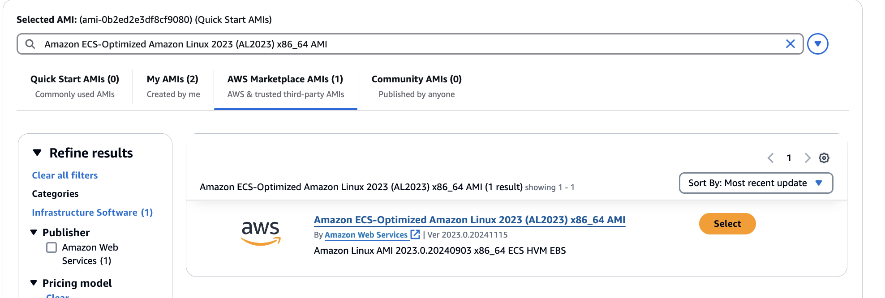
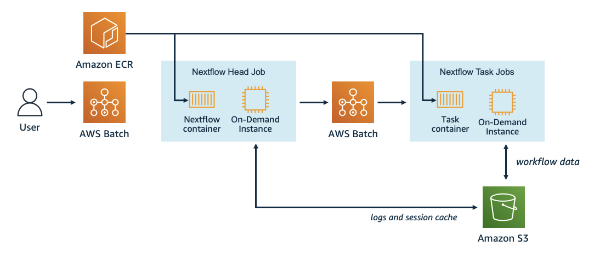
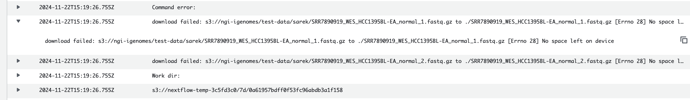

# AWS set up

&nbsp;
&nbsp;
&nbsp;


## Step 1: create AMI

> NOTE: These instructions currently use the console, but they should be updated in the future to use the AWS CLI for a more automated and efficient process

**1-** Go to EC2 dashboard -> Instances -> Launch instance -> Browse more AMIs, Then click "AWS Marketplace AMIs" -> search for ECS -> filter by “Free” -> Select 
Amazon ECS-Optimized Amazon Linux 2023 (AL2023) x86_64 AMI (or other recent one) -> click Subscribe now

<p align="center">
  
</p>


**2-** In section **Instance type** select instance type = m5.large, and in section **Key pair** -> create new key pair. Save the *.pem file

**3-** Check that in the section **Network settings**, “Auto-assign Public ID” is ENABLED, otherwise, click “Edit” and enable it. Create a new security group that allows ssh traffic from anywhere to be able to ssh to the instance.

**4-** In section **Configure storage** select 30Gb gp3 (root volume) and add another 500Gb EBS volume

**5-** Click “Create Instance”

**6-** Add aws-cli to the AMI

To SSH into your EC2 instance on AWS, you'll need the **public IP address** of your instance (find it in the AWS console -> instance) and the **key pair file** (.pem) associated with it.

```
#- add permissions
chmod 400 <KEYPAIR.pem>

#- ssh to the instance you just created
ssh -i <KEYPAIR.pem> ec2-user@<AMI_PUBLIC_IP_ADDRESS>
sudo yum update

#- install aws-cli using miniconda
cd $HOME
sudo yum install -y bzip2 wget
wget https://repo.continuum.io/miniconda/Miniconda3-latest-Linux-x86_64.sh
bash Miniconda3-latest-Linux-x86_64.sh -b -f -p $HOME/miniconda
$HOME/miniconda/bin/conda install -c conda-forge -y awscli
rm Miniconda3-latest-Linux-x86_64.sh
```

**7-** Under the Instances menu select your relevant instance and click Actions -> Images and Templates -> Create Image. **Take note of the AIM as you ou will need it later** (not the name)

**8-** Once the AMI has been created, the instance can be stopped or terminated, as this instance was used solely for the purpose of creating the AMI


&nbsp;

## Step 2: build Nextflow container

If needed, free up space 
```
sudo docker system prune -a
```

Create Repo
```
REPOSITORY_NAME="hackathon-container"
aws ecr create-repository --repository-name ${REPOSITORY_NAME}
```


Add entry point data
_(modified from `s3://ws-assets-prod-iad-r-cmh-8d6e9c21a4dec77d/1ff03bed-5358-4eec-84de-1a99cdc81a76/entrypoint.sh`)_

```
cat > entrypoint.sh << EOFF
#!/bin/bash
set -ex

PIPELINE_URL=\${PIPELINE_URL:-https://github.com/seqeralabs/nextflow-tutorial.git}
NF_SCRIPT=\${NF_SCRIPT:-main.nf}
NF_OPTS=\${NF_OPTS}
NF_CONFIG=/root/.nextflow/config

cat << EOF > \$NF_CONFIG
profiles {
  standard {
      process.container = 'nextflow/rnaseq-nf:s3'
      docker.enabled = true
     }
  batch {
      aws.region = "\$AWS_REGION"
      process.container = 'nextflow/rnaseq-nf:s3'
      process.executor = 'awsbatch'
      process.queue = "\$NF_JOB_QUEUE"
      docker.enabled = true
      aws.batch.cliPath = "/home/ec2-user/miniconda/bin/aws" 
    }
}
EOF

echo "=== CONFIGURATION ==="
cat /root/.nextflow/config

if [[ -z \${AWS_REGION} ]];then
        AWS_REGION=\$(curl --silent \${ECS_CONTAINER_METADATA_URI} |jq -r '.Labels["com.amazonaws.ecs.task-arn"]' |awk -F: '{print \$4}')
fi

if [[ "\${PIPELINE_URL}" =~ ^s3://.* ]]; then
        aws s3 cp --recursive \${PIPELINE_URL} /scratch
    else
        # Assume it is a git repository
        git clone \${PIPELINE_URL} /scratch
fi

cd /scratch
echo ">> Remove container from pipeline config if present."
sed -i -e '/process.container/d' nextflow.config

nextflow run \${NF_SCRIPT} \${NF_OPTS} 
EOFF

chmod +x entrypoint.sh
```

Download dockerfile 

```
wget -N https://raw.githubusercontent.com/lconde-ucl/sarek_aws/refs/heads/main/Dockerfile
```


Build container

```
ImageId=`aws ecr describe-repositories --repository-names ${REPOSITORY_NAME} --output text --query 'repositories[0].[repositoryUri]' --region $AWS_REGION`
echo "export ImageId=${ImageId}"

docker build -t ${ImageId}:latest .
```

Push command to ECR
```
aws ecr get-login-password --region $AWS_REGION | docker login --username AWS --password-stdin ${ImageId/${REPOSITORY_NAME}}

docker push ${ImageId}:latest
```

&nbsp;

## Step 3: deploy architechture on AWS Batch


<p align="center">
  
</p>


Create Input, output and work buckets (input not needed for test runs)

```
BUCKET_POSTFIX=$(uuidgen --random | cut -d'-' -f1)
export BUCKET_NAME_RESULTS=nextflow-results-${BUCKET_POSTFIX}
export BUCKET_NAME_INPUT=nextflow-input-${BUCKET_POSTFIX}
export BUCKET_NAME_TEMP=nextflow-temp-${BUCKET_POSTFIX}

aws s3 mb s3://${BUCKET_NAME_RESULTS}
aws s3 mb s3://${BUCKET_NAME_INPUT}
aws s3 mb s3://${BUCKET_NAME_TEMP}

# save variable names to file
echo "export BUCKET_NAME_RESULTS=${BUCKET_NAME_RESULTS}
export BUCKET_NAME_TEMP=${BUCKET_NAME_TEMP}
export BUCKET_NAME_INPUT=${BUCKET_NAME_INPUT}" > s3_vars
```

Create an IAM role
```
cat > ecs-tasks-trust-policy.json << EOF
{
"Version": "2012-10-17",
"Statement": [
    {
    "Sid": "",
    "Effect": "Allow",
    "Principal": {
        "Service": "ecs-tasks.amazonaws.com"
    },
    "Action": "sts:AssumeRole"
    }
]
}
EOF

aws iam create-role --role-name ecsTaskExecutionRole --assume-role-policy-document file://ecs-tasks-trust-policy.json

aws iam attach-role-policy  --role-name ecsTaskExecutionRole  --policy-arn arn:aws:iam::aws:policy/service-role/AmazonECSTaskExecutionRolePolicy
```


Set up AWS Batch Resources

```
VPC_ID=`aws ec2 describe-vpcs --output text --query 'Vpcs[*].VpcId' --filters Name=isDefault,Values=true --region ${AWS_REGION}`
echo "export VPC_ID=${VPC_ID}"

SUBNET_IDS=`aws ec2 describe-subnets --query "Subnets[*].SubnetId" --filters Name=vpc-id,Values=${VPC_ID} --region ${AWS_REGION} --output text | sed 's/\s\+/,/g'`
echo "export SUBNET_IDS=${SUBNET_IDS}"
```

Deploy CE from template _(modified from `s3://ws-assets-prod-iad-r-cmh-8d6e9c21a4dec77d/1ff03bed-5358-4eec-84de-1a99cdc81a76/nextflow-batch-ce-jq.template.yaml`)_. **Add here the ID and TYPE of the AMI that you created in step 1**
```
wget -N https://raw.githubusercontent.com/lconde-ucl/sarek_aws/refs/heads/main/nextflow-batch-ce-jq.template.yaml

#- Add the ID and TYPE of the AMI that you created in step 1
AMI_ID=<AMI_ID, e.g: ami-xxxx> 
AMI_TYPE=<AMY_TYPE, e.g: ECS_AL2023>
echo "export AMI_TYPE=${AMI_ID}"
echo "export AMI_TYPE=${AMI_TYPE}"

aws cloudformation deploy --stack-name nextflow-batch-ce-jq --template-file nextflow-batch-ce-jq.template.yaml --capabilities CAPABILITY_IAM --region ${AWS_REGION} --parameter-overrides VpcId=${VPC_ID} SubnetIds=${SUBNET_IDS} DefaultImageIdOverride=${AMI_ID} DefaultImageType=${AMI_TYPE}
```

Set up AWS Batch Job Definition.
```
ImageId=`aws ecr describe-repositories --repository-names ${REPOSITORY_NAME} --output text --query 'repositories[0].[repositoryUri]' --region $AWS_REGION`
echo "export ImageId=${ImageId}"

ECSRoleName=ecsTaskExecutionRole
ECSRoleArn=`aws iam get-role --role-name ${ECSRoleName} --query 'Role.[Arn]' --output text`
echo "export ECSRoleArn=${ECSRoleArn}"

NFJobQueue=nextflow-jq
echo "export NFJobQueue=${NFJobQueue}"
```

Deploy JD from template _(modified from s3://ws-assets-prod-iad-r-cmh-8d6e9c21a4dec77d/1ff03bed-5358-4eec-84de-1a99cdc81a76/nextflow-batch-jd.template.yaml)_

```
wget -N https://raw.githubusercontent.com/lconde-ucl/sarek_aws/refs/heads/main/nextflow-batch-jd.template.yaml

aws cloudformation deploy --stack-name nextflow-batch-jd --template-file nextflow-batch-jd.template.yaml --capabilities CAPABILITY_IAM --region ${AWS_REGION} --parameter-overrides NFJobQueue=${NFJobQueue} ImageId=${ImageId} ECSRoleArn=${ECSRoleArn} AWSRegion=${AWS_REGION}
```

Describe Your Environment (if you wish)
```
aws batch describe-compute-environments --region $AWS_REGION
aws batch describe-job-queues --region $AWS_REGION
aws batch describe-job-definitions --region $AWS_REGION
```

&nbsp;

## Step 4a: run Sarek with the test profile

> **NOTE1:** This completes successfully, however, the `-resume` option does not work, jobs don't cache when resubmitted, even if the `BUCKET_NAME_RESULTS` and `BUCKET_NAME_TEMP` remain the same. this is probably related to [this issue](https://github.com/nextflow-io/nextflow/discussions/4876)

> **NOTE2:** If you want to track your jobs in seqera platform, add your TOWER_ACCESS_TOKEN below

```
NXF_VER=24.04.4
NXF_DSL=2
export NXF_VER=${NXF_VER}
export NXF_DSL=${NXF_DSL}

#- Add your tower access token if you wnat to track your jobs in sequera platform:
TOWER_ACCESS_TOKEN="xxxxxxxxx"
echo "export TOWER_ACCESS_TOKEN=${TOWER_ACCESS_TOKEN}"
TOWER=" -with-tower"

#- otherwise leave blank
TOWER_ACCESS_TOKEN=""
echo "export TOWER_ACCESS_TOKEN=${TOWER_ACCESS_TOKEN}"
TOWER=" "

cat > sarek-job.json << EOF
{
    "jobName": "sarek-test",
    "jobQueue": "nextflow-jq",
    "jobDefinition": "nextflow-demo",
    "timeout": {"attemptDurationSeconds": 3600},
    "containerOverrides": {
         "command": [
                "/usr/local/bin/entrypoint.sh"
         ],
         "resourceRequirements": [
                { "value": "24576", "type": "MEMORY" },
                { "value": "16", "type": "VCPU" }
        ],
        "environment": [
            {"name": "PIPELINE_URL","value": "https://github.com/nf-core/sarek"},
            {"name": "NF_SCRIPT","value": "main.nf"},
            {"name": "NXF_DEFAULT_DSL","value": "${NXF_DSL}"},
            {"name": "NXF_VER","value": "${NXF_VER}"},
            {"name": "JAVA_TOOL_OPTIONS", "value": "-Xms24G -Xmx24G"},
            {"name": "TOWER_ACCESS_TOKEN","value": "${TOWER_ACCESS_TOKEN}"},
            {"name": "NF_OPTS","value": "-profile batch,test --outdir s3://${BUCKET_NAME_RESULTS}/sarek_test -work-dir s3://${BUCKET_NAME_TEMP}/work -resume ${TOWER}"}
        ]
    }
}
EOF

aws batch submit-job --cli-input-json file://sarek-job.json
```

&nbsp;

## Step 4b: run Sarek with the test_full profile

> **NOTE1:** This starts running eventually fails with `No space left on device` errors. Is this an issue with not enough EBS volume? The AMI I'm using has 30GB root + 500GB additional volume. Do we need to set up EBS auto-scaling? Some people mentioned similar issues [here](https://nfcore.slack.com/archives/CE7FBAMRP/p1644881905070519) and [here](https://stackoverflow.com/questions/74596201/nextflow-sarek-pipeline-on-aws-batch)

<p align="center">
  
</p>

> **NOTE2:** Using an AMI with 64GB root + 1000GB additional volume, the run goes further but eventually also fails with `No space left on device errors`


&nbsp;

```
NXF_VER=24.04.4
NXF_DSL=2
export NXF_VER=${NXF_VER}
export NXF_DSL=${NXF_DSL}

#- Add your tower access token if you wnat to track your jobs in sequera platform:
TOWER_ACCESS_TOKEN="xxxxxxxxx"
echo "export TOWER_ACCESS_TOKEN=${TOWER_ACCESS_TOKEN}"
TOWER=" -with-tower"

#- otherwise leave blank
TOWER_ACCESS_TOKEN=""
echo "export TOWER_ACCESS_TOKEN=${TOWER_ACCESS_TOKEN}"
TOWER=" "

cat > sarek-job.json << EOF
{
    "jobName": "sarek-full-test",
    "jobQueue": "nextflow-jq",
    "jobDefinition": "nextflow-demo",
    "timeout": {"attemptDurationSeconds": 259200},
    "containerOverrides": {
         "command": [
                "/usr/local/bin/entrypoint.sh"
         ],
         "resourceRequirements": [
                { "value": "65536", "type": "MEMORY" },
                { "value": "16", "type": "VCPU" }
        ],
        "environment": [
            {"name": "PIPELINE_URL","value": "https://github.com/nf-core/sarek"},
            {"name": "NF_SCRIPT","value": "main.nf"},
            {"name": "NXF_DEFAULT_DSL","value": "${NXF_DSL}"},
            {"name": "NXF_VER","value": "${NXF_VER}"},
            {"name": "JAVA_TOOL_OPTIONS", "value": "-Xms24G -Xmx24G"},
            {"name": "TOWER_ACCESS_TOKEN","value": "${TOWER_ACCESS_TOKEN}"},
            {"name": "NF_OPTS","value": "-profile batch,test_full --outdir s3://${BUCKET_NAME_RESULTS}/sarek_test -work-dir s3://${BUCKET_NAME_TEMP}/work -resume ${TOWER}"}
        ]
    }
}
EOF

aws batch submit-job --cli-input-json file://sarek-job.json
```


